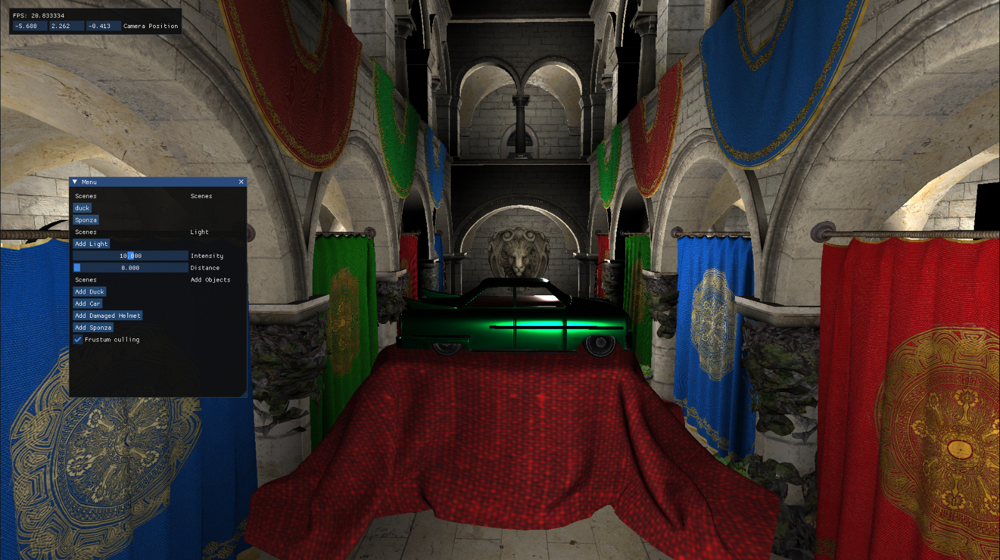

# Vulkan Renderer



Simple Vulkan Renderer That I've began to work on. The purpose is to learn about the API and how to write efficient code on it.

# Features

The program is aimed to minimize as much draw processing as possible in the cpu side, by implementing techniques such as indirect draws, double buffering and compute based culling.

Right now it supports gltf scene loading, forward+ rendering and pbr materials.

## Forward + Rendering

In order to have multiple lights in the scene a Forward+ (or tiled) method have been used. This method will split the framebuffer in tiles and only compute the lights which are affecting the specific objects displayed in that tile. As in order to get that we'll need to precalculate the depth buffer (z pre-pass), by the moment we're using the scene previous z buffer, however this may cause some artifacts in the image and we'll build a proper depth prepass once occlusion culling is implemented.

### Demonstration of Forward+ in video
[](https://www.youtube.com/watch?v=RQ28iZkKedY)

# Build

The project is built with CMake and should run either on Windows or Linux (Ubuntu tested).
It has most of it's sources bundled with it, only depending on:
- GLM
- Vulkan (LunarG's Vulkan SDK required)

Instructions for Linux:

```
mkdir build &
cd build &
cmake .. &
make
```

Usage

```
./VkRaster <glb file path>
```