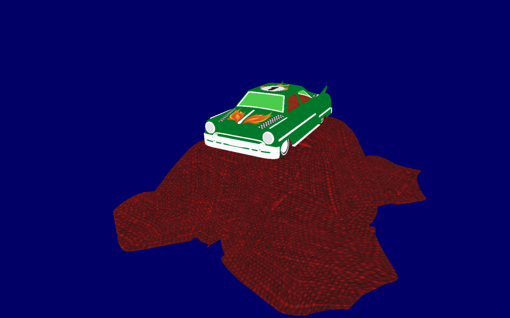

# vkRaster



Simple Vulkan Renderer That I've began to work on. The purpose is to learn about the API and how to write efficient code on it.

# Features

The program is aimed to minimize as much draw processing as possible in the cpu side, by implementing techniques such as indirect draws, double buffering and compute based culling.

Right now it can display unlit gltf scenes with a FPS camera, with the gltf scene paths being hardcoded on the main.cpp file.

| Feature | Progress |
| - | - |
| Textures | Implemented |
| gltf scene loading | Implemented |
| PBR Materials | Implemented |
| Compute based culling | Only frustum culling |
| Lighting | Forward rendering |
| Postprocessing | Not yet |

# Build

The project is built with CMake and should run either on Windows or Linux (Ubuntu tested).
It has most of it's sources bundled with it, only depending on:
- GLM
- Vulkan (LunarG's Vulkan SDK required)

Instructions for Linux:

```
mkdir build &
cd build &
cmake .. &
make
```